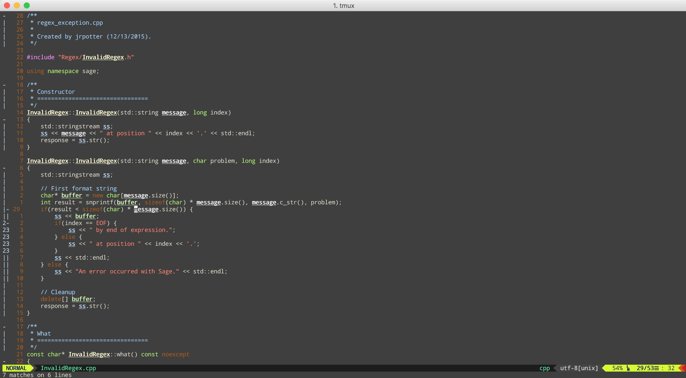

Highlight
=========

[VERSION: 0.1]

Demo
----



Overview
--------

Builds a custom registry for manipulating highlights. In particular, I found it
necessary to search for different keywords without overriding previous searches;
that is, I wanted to be able to continue adding more words to a search without
having to keep track of which words I've already searched for.

Refer to ```doc/``` for complete instructions on use.

Installation
------------

I prefer using [vim-plug](https://github.com/junegunn/vim-plug) for plugin
management as follows:

```vim
Plug 'jrpotter/vim-highlight'
```

Follow use according to plugin manager you use or optionally copy
plugin/highlight.vim from this repo into ```$VIM_DIR/plugin```.

Usage
-----

Put your cursor over a given word and press ```&``` to append the ```<cword>```
under the cursor into the ```"``` register by default. Navigating from this
highlighted word to other occurrences are then done by ```n``` and ```N``` to
move forward and backward respectively. To append another ```<cword>``` into
the register, move other another cursor and press ```&```. Now pressing ```n```
or ```N``` will navigate to occurrences of both words.

To clear out this register, just press ```c&```. If you want to keep these words
highlighted but begin another search, you can use another register. By default,
the search is replaced by said register. So, if after using the default register
you place your cursor over another ```<cword>``` and press ```"1&```, you'll
begin another search and navigate accordingly. To switch back to the original
register, press ```y&```.

To remove a selected word, press ```d&```. Note each ```[c|d|y]&``` can be
prepended with a register as well.

Overloading of ```*```, ```#```, ```g*```, and ```g#``` is also done.

Lastly, the numeral registers are highlighted different colors but by default
none of the other registers are. Instead, they are initialized with the
```g:highlight_register_default_color``` variable, which starts with value
"Yellow."
